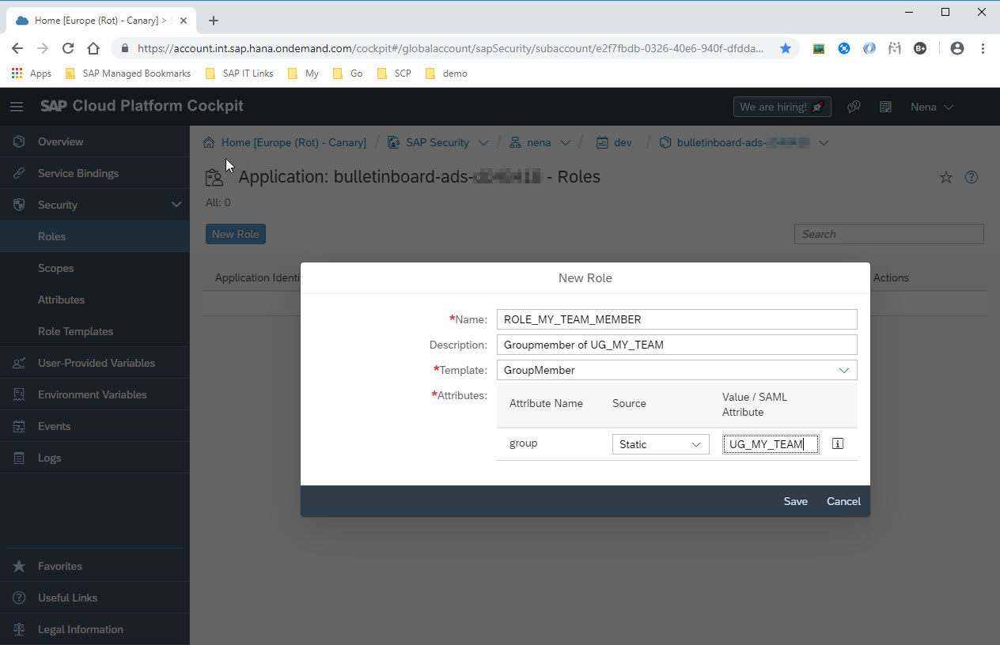

# Access Limitation on Instances using Spring ACL

This [Spring Boot](http://projects.spring.io/spring-boot/) 2.0 demo application shows how to implement instance-based access control in Spring based SAP Cloud Platform applications. It leverages [Spring Security ACL](https://github.com/spring-projects/spring-security) and integrates to SAP Cloud Platform XSUAA service using the [SAP Container Security Library (Java)](https://github.com/SAP/cloud-security-xsuaa-integration/tree/develop), which is available on [maven central](https://search.maven.org/search?q=com.sap.cloud.security).

Instances, you want to protect, could be **business objects** (e.g. procurement order), **data records** on the database (e.g. leave request) or any other **resource**.

The microservice is adapted from the code developed in the [openSAP course: Cloud-Native Development with SAP Cloud Platform](https://open.sap.com/courses/cp5) and runs in the Cloud Foundry environment within SAP Cloud Platform.

## Table of Contents
This document is divided into the following sections
 - [Motivation](#motivation)
 - [Comparison of the Filter Approach with the ACL Approach](#comparison)
 - [Examples / Use Cases](#examples) - Use cases and how Spring ACL helps
 - [Setup and Start](#setupandstart) - a description of how to use this project
 - [Implementation Details](#notes) - dig into details of its implementation, configuration 
 - [Further Learning Material](#furtherReading) - references and further learning material

<a id='motivation'></a>
## Motivation
Assume you have a cloud-native Spring(Boot) application that exposes REST APIs to access (read, write,...) instances that are worth protecting. An instance could be a business object having the type of a procurement order, a leave request or in our case an advertisement. With Spring Security ACL you can control the access to dedicated instances. 

An **Access Control List (ACL)** is a list of permissions attached to a dedicated instance. An ACL specifies for an instance which operations (e.g. read, write, publish, ...) are granted to an identity. An identity can be a user principal or match to a user role/attribute.

Spring ACL approach can be useful when:
- The instance-based access cannot solely be protected by roles (scopes and attributes), and in addition there is no "static" criteria (like cost center, confidentiality level, ...) that could be used as a filter. Then the decision whether a user is authorized for a certain instance can be defined per instance completely free of limitations just by maintaining the ACL.
- If the instance-based access shall change dynamically during the instance lifecycle without the change of an attribute value this can be done by changing the ACL without changing the object itself.
- The instance owner wants to delegate permissions to a dedicated user/substitute without consulting the administrator. For example, during vacation a manager likes to delegate the approvals of leave requests to the dedicated team leads.
-	The user's authorization is related to an object, that does not directly belong to the core domain of your application, like cost-center and is therefore not part of your application persistence. Still ACL entries can reflect this kind of relationships between application instances and foreign domain object as part of the ACL.
- You want to model ACL hierarchies.
  - For example, you are a facilitator and you have edit-permissions to some buildings within a location. Furthermore, you should have the same permissions to most of the rooms, that are linked to the buildings.
  - Same could be the case for organizational hierarchies, like cost center.
- You like to manage the ACL as part of your application and close to the instances, you want to protect without delegating the task of authorization management to a dedicated user administrator. 

Additionally, Spring ACL simplifies the implementation of audit logs and GDPR compliance as all relevant data is stored in central authorization tables.

<a id='comparison'></a>
## Comparison of the Filter Approach with the ACL Approach

### Advantages of the Filter Approach
+ Simplicity, and lower development effort as no additional infrastructure is needed.

### Advantages of the ACL Approach
+ The authorization decision is better understandable as missing authorizations can be clearly identified as such and not just as a reduced result list of an operation that can have different reasons.
+ Auditability and effort for logging of the authorization relevant data is much easier as all information is kept in a central place (the ACL tables) and not distributed in application tables that have to care for change log themselves.
+ The ACL Approach can be combined with the Filter approach (with the cost of an additional table JOIN).

<a id='examples'></a>
## Examples / Use cases

### Create an protect-worthy instance and assign initial permissions to owner
The user with log-on name `advertiser` creates a new advertisement (id = `55`). You can test with POST-request `/api/v1/ads/acl/` that the following entries are created in the postgreSql `test` database.

- For the user principal `advertiser` an entry gets created (if not yet there) in the `ACL_SID` table:

   id | principal | sid  
  -- | ---- | --------  
   7 | true | advertiser 

- For the new advertisement instance with id `55` an entry gets created in the `ACL_OBJECT_IDENTITY` table:

  id | object_id_class | object_id_identity | parent_object | owner_sid | entries_inheriting |
  --- | --- | --- | --- | --- | --- |
  ... | ... | ... | ... | ... | ... |
  3 | 1 | 55 | 1200 | 1 | true |

  > The `ACL_OBJECT_IDENTITY` table refers to an `com.sap.cp.appsec.domain.Advertisement` instance. The advertisement instance id is specified in the `object_id_identity` column and its type is classified in the `ACL_CLASS` table.

- For each permission (read, write, admin, ...) the user (sid = `7`) gets for the instance (acl_object_identity = `3`) an `ACL_ENTRY` table entry:

  id | acl_object_identity | ace_order | sid | mask | granting | audit_success | audit_failure | 
  -- | - | - | - | -- | ---- | ---- | ---- | 
  26 | 3 | 0 | 7 |  1 | true | true | true | 
  27 | 3 | 1 | 7 |  2 | true | true | true | 
  28 | 3 | 2 | 7 | 16 | true | true | true |

  > It's possible to insert both granting and revoking entries in `ACL_ENTRY`, the `ace_order` matters meaning it's possible to revoke access in line 0 and that will take precedence over a grant on line 1.

### Delegate: grant write-permission to individuals
Any user with "admin" permission (e.g. instance owner) for an advertisement should be able to grant permissions to other individuals (e.g. `myfriend`) without involvement of an administrator. You can test with PUT-request to `/api/v1/ads/acl/grantPermissionsToUser/{id}`.

- Again, for the user principal `myfriend` an entry gets created (if not yet there) in the `ACL_SID` table:

  id | principal | sid  
  -- | ---- | --------  
   7 | true | advertiser 
   8 | true | myfriend 
   
- For each permission (read, write, admin, ...) the user (sid = `8`) gets for the instance (acl_object_identity = `3`) an `ACL_ENTRY` table entry:

  id | acl_object_identity | ace_order | sid | mask | granting | audit_success | audit_failure | 
  -- | - | - | - | -- | ---- | ---- | ---- | 
  ... | ... | ... | ... |  ... | ... | ... | ... | 
  29 | 3 | 3 | 8 |  1 | true | true | true | 
  30 | 3 | 4 | 8 |  2 | true | true | true | 
  31 | 3 | 5 | 8 | 16 | true | true | true |   

### Collaborate: grant write-permission to my team members
Any user with "admin" permission for an advertisement should be able to grant permission to all users of a dedicated user group. You can test with PUT-request to `/api/v1/ads/acl/grantPermissionsToUserGroup/{id}`.

First question might be, how to model / specify a user group? How we've done it: any user must provide its group assignnments as `xs.user.attributes` as part of its JWT token:

```
{   
    ...
    "scope": [],
    "xs.user.attributes": {
       "group": [
          "UG_MY_TEAM"
       ]
    }
}
```

These groups e.g. `UG_MY_TEAM` must be exposed in the `ACL_SID` table:

  id | principal | sid  
  --- | ---- | --------  
  7  | true | advertiser 
  8  | true | myfriend 
  9  | false | ATTR:GROUP=UG_MY_TEAM
  10 | false | ATTR:GROUP=UG_OTHER_TEAM
   
For each permission (read, write,...) the user group "UG_MY_TEAM" (sid = `9`) gets for the instance (acl_object_identity = `3`) an `ACL_ENTRY` table entry as we've learnt in the examples above. With that the number of `ACL_ENTRY` table entries can be reduced by the number of individuals a user group consists of.

### Append instance to a parent instance and inherit its permissions
Now the `advertisement` (id = `55`) is in a final state and should be published to a bulletinboard that is watched by many other people.

Here the user acts as "publisher", who requires "admin" permission of the advertisement to be published as well as access to the target bulletinboard:

```
{   
    ...
    "scope": [],
    "xs.user.attributes": {
       "bulletinboard": [
          "DE_WDF03_Board"
       ]
    }
}
```

Note that in our case the bulletinboard is not a core domain object that is *managed* by our `Advertisement` application.
So we'd only like to refer to it by a key of type `java.lang.String`.

- "Static" entries in `ACL_CLASS` table:

  | id | class | class_id_type |
  | -- | ----- | ------------- |
  | 2.000 | location | java.lang.String |
  | 2.002 | bulletinboard | java.lang.String |
  | 1 | com.sap.cp.appsec.domain.Advertisement | java.lang.Long |

  > Note that the target parent instance - in our case the `bulletinboard` - must not necessarily be an instance of a Java Class with an identifier of type `java.lang.Long`. With Spring security version `5.2.0` you can also specify a unique identifier such as `DE_WDF03_Board` of type `java.lang.String` or `java.util.UUID` in the `ACL_OBJECT_IDENTITY` table.

- Entries in `ACL_OBJECT_IDENTITY` before publishing:

  id | object_id_class | object_id_identity | parent_object | owner_sid | entries_inheriting |
  -- | -- | -- | -- | -- | -- |
  1.100 | 2.000 | DE | [NULL] | 3.000 | false |
  1.101 | 2.000 | IL | [NULL] | 3.000 | false |
  1.200 | 2.002 | DE_WDF03_Board | 1.100 | 3.005 | true |
  1.201 | 2.002 | DE_WDF04_Board | 1.100 | 3.005 | true |
  1.202 | 2.002 | IL_RAA03_Board | 1.101 | 3.005 | true |
  3 | 1 | 55 | [NULL] | 1 | true |

- After successful publishing the column `parent_object` of the advertisements `ACL_OBJECT_IDENTITY` entry has changed:

  id | object_id_class | object_id_identity | parent_object | owner_sid | entries_inheriting |
  -- | -- | -- | -- | -- | -- |
  ... | ... | ... | ... | ... | ... |
  3 | 1 | 55 | 1200 | 1 | true |
  

### Pageable access to all instances i have explicit / implicit access to
User with permissions for a bulletinboard, has the same permissions for its (published) advertisement instances. In this case the advertisement instances inherits the permissions of the parent instance, i.e. the bulletinboard.

User with permissions for a location, has the same permissions for its bulletinboards and as well its (published) advertisement instances. In this case the advertisement instances inherits the permissions of its parent instances, i.e. the bulletinboard, location.

User with "read" permission can paginate advertisement instances, he has "read" authorizations for. You can test with GET-request to `http://localhost:8080/api/v1/ads/acl/published`.

### Remove permissions
User with "admin" permission for an advertisement can remove permissions to it from users (user groups). You can test with PUT-request to `/api/v1/ads/acl/removePermissionsFromUser/{id}`.

After this the related entries for the principal user (sid) should disappear from the `ACL_ENTRY` table.


# <a name="setupandstart"></a>Setup and Start
## Prerequisites
Setup your development environment with at least java, maven, docker ... as explained [here](/prerequisites/README.md). 


### Prepare local environment

The application is setup to connect to a PostgreSQL database.

For this, the local system environment variable `VCAP_SERVICES` must contain the corresponding connection information.
The provided `localEnvironmentSetup.bat` script can be used to set the necessary values. Within your development IDE (Eclipse, IntelliJ), you need to define the `SPRING_PROFILES_ACTIVE`, `VCAP_SERVICES` and `VCAP_APPLICATION` environment variable as done in this script.

Replace in your `spring-security-acl` project any occurence of `d012345` or `D012345` by your SAP Account User Name.

## Run the application in your local environment
Make sure that PostgreSQL is running on the local machine, as referenced in `VCAP_SERVICES`. 

The `docker-compose.yml` specifies all required docker containers.   
In order to start a fresh database container with postgresql, execute 
```bash
docker-compose up -d
```
To tear down all containers, execute:
```bash
docker-compose down
```

To run the service locally you have two options: start it directly via Maven on the command line or within Eclipse.

In both cases, your application will be deployed to an embedded Tomcat web server and is visible at the address `http://localhost:8080/api/v1/ads/acl`.

### Run on the command line
Execute in terminal (within project root e.g. ~/git/cc-bulletinboard-ads-spring-boot, which contains the`pom.xml`):
```bash 
source localEnvironmentSetup.sh
./mvnw spring-boot:run
```

Or on Windows command line:
```bash
localEnvironmentSetup.bat
mvnw spring-boot:run
```

### Run in Eclipse (STS)
In Eclipse Spring Tool Suite (STS) you can import the project as an existing Maven project. There you can start the main method in `com.sap.cp.appsec.Application`.
You can also right-click on the class in the Package Explorer, and select `Run As` - `Spring Boot App`. Make sure that you have set in the same environment variables in the Run Configuration as specified in the [`localEnvironmentSetup script`](localEnvironmentSetup.bat).

## Test locally using Postman
The service endpoints are secured, that means no unauthorized user can access the endpoint. The application expects a so called `JWT token` as part of the `Authorization` header of the service that also contains the scope, the user is assigned to.

Test the REST Service `http://localhost:8080/api/v1/ads` manually using the `Postman` chrome extension.
You can import the [Postman collection](documentation/testing/spring-acl-local.postman_collection.json), as well as the [Postman environment](documentation/testing/spring-acl-local.postman_environment.json) that provides different JWT tokens for the `Authorization` headers to do some sample requests for local execution.

**Note**: For all requests make sure, that you provide a header namely `Authorization` with a JWT token as value e.g. `Bearer eyJhbGciOiJSUzI1NiIs...`. You can generate a valid JWT token as described [in Exercise 24](https://github.com/SAP/cloud-bulletinboard-ads/blob/Documentation/Security/Exercise_24_MakeYourApplicationSecure.md#generate-jwt-token).

## Steps to deploy to Cloud Foundry

### Build Advertisement Service (our Java application)
Build the Advertisement Service which is a Java web application running in a Java VM. Maven build tool compiles the code and packages it in its distributable format, such as a `JAR` (Java Archive). With this the maven dependencies are downloaded from the SAP internal Nexus registry and are copied into the directory `~/.m2/repository`. Furthermore the JUnit tests (unit tests and component tests) are executed and the `target/demo-application-security-acl.jar` is created. 

Execute in the command line (within project directory, which contains the`pom.xml`):
```
./mvnw package
```
... or `mvnw package` in Windows command line.

### Login to Cloud Foundry
Make sure your are logged in to Cloud Foundry and you target your trial space.  
The following commands will setup your environment to use the provided Cloud Foundry instance.

 - `cf api <<Your API endpoint>>`
 - `cf login -u <<your user id>>`
 - In case you are assigned to multiple orgs, select the `trial` organisation.

To find the API end point, please refer the [documentation]( https://help.sap.com/viewer/65de2977205c403bbc107264b8eccf4b/Cloud/en-US/350356d1dc314d3199dca15bd2ab9b0e.html)


### Create Services
Create the (backing) services that are specified in the [`manifest.yml`](manifest.yml).

Execute in terminal (within project directory, which contains the `security` folder):
```
cf create-service postgresql v9.6-dev postgres-bulletinboard-ads
cf create-service xsuaa application uaa-bulletinboard -c security/xs-security.json
```
> Using the marketplace (`cf m`) you can see the backing services and its plans that are available on SAP CP and (!) you are entitled to use.

 
### Deploy the approuter and the advertisement service
As a prerequisite step open the `manifest.yml` and replace the d-user by your sap user, to make the routes unique.

The application can be built and pushed using these commands (within root directory, which contains the`manifest.yml`):
```
cf push -f manifest.yml
```
The application will be pushed using the settings in the provided in `manifest.yml`. You can get the exact urls/routes that have been assigned to the application with `cf apps`.

### Create approuter route per tenant id
We make use of the `trial` subaccount. As you can see in the SAP CP Cockpit subaccounts have properties (see *Subaccount Details*) which of the most important one is the **Subdomain**. The Subdomain serves as the value for the technical property Tenant ID (e.g. "d012345trial").

The Tenant ID is encoded in the url, for example `https://<tenantId>-<approuter>.<domain>`. That's why we need to specify per Tenant ID (subdomain name) an approuter route:
```
cf map-route approuter-d012345 cfapps.sap.hana.ondemand.com -n d012345trial-approuter-d012345
```

> Note: the `TENANT_HOST_PATTERN` environment variable ( see `manifest.yml` file) specifies how the approuter should derive the tenant from the URL.

### Cockpit administration tasks
Go to the [SAP Cloud Platform Cloud Cockpit](https://account.hanatrial.ondemand.com/#/home/welcome)
- Navigate to your bulletinboard-ads application. Create some Role, e.g. `ROLE_MY_TEAM_MEMBER` based on the `GroupMember` role template. And specify its attribute `groups`=UG_MY_TEAM  
  

> Note: Alternatively, in case your IdP supports SAML user attributes, you can also map to a dedicated SAML user attribute e.g. `Groups`. This gives you the advantage to inherit all group values, that are managed as part of the IdP.  

- Then navigate to your Subaccount and create a Role Collection e.g. `RC_GroupMember_MY_TEAM` and add the created Role.
- Finally, as part of your Identity Provider, e.g. SAP ID Service, assign the created Role Collection to your user.

Note: further up-to-date information you can get on sap.help.com: [Maintain Roles for Applications](https://help.sap.com/viewer/65de2977205c403bbc107264b8eccf4b/Cloud/en-US/7596a0bdab4649ac8a6f6721dc72db19.html))

### Test the deployed application
Open a browser to test whether your microservice runs in the cloud. For this use the approuter URL, e.g. `https://d012345trial-approuter-d012345.cfapps.<<region>>.hana.ondemand.com/ads/actuator/health`. This will bring you the **login page**. Note: You have to enter here your SAP Cloud Identity credentials. After successful login you get redirected to the advertisement service that returns you the status of the application.


This [`xs-app.json`](src/main/approuter/xs-app.json) file specifies how the approuter routes are mapped to the advertisement routes.

Test the deployed REST Service on Cloud Foundry via the approuter url using the `Postman` chrome plugin together with the `Postman Interceptor` chrome plugin. You can import the [Postman collection](documentation/testing/spring-acl-cloudfoundry.postman_collection.json) and create an environment, which specifies the key-value pair `approuterUri`=`https://<<your tenant>>-approuter-<<your user id>>.cfapps.<<region>>.hana.ondemand.com`. 

Find a step-by-step description on how to test using `Postman` [here](https://github.com/SAP/cloud-bulletinboard-ads/blob/Documentation/Security/Exercise_24_MakeYourApplicationSecure.md).

<a id='notes'></a>
## Implementation Details 

1. Setup Spring ACL database table (using liquibase): [database changelog](src/main/resources/db.changelog), [database changelog](src/main/resources/db.population)
1. Configure Spring ACL: [AclConfig](src/main/java/com/sap/cp/appsec/config/AclConfig.java) and [AclAuditLogger](src/main/java/com/sap/cp/appsec/config/AclAuditLogger.java)
1. Convenience wrapper for Spring `AclService` implementation: [AclSupport](https://github.wdf.sap.corp/CPSecurity/cp-application-security/blob/master/spring-security-acl/src/main/java/com/sap/cp/appsec/security/AclSupport.java)
1. The application needs to support values-request for the application-specific `xs.user.attributes`, e.g. `group : [AttributeFinderController](src/main/java/com/sap/cp/appsec/controllers/AttributeFinderController.java).
1. Assign user's attributes to Spring Security Context: [CustomAuthenticationProvider](src/main/java/com/sap/cp/appsec/security/CustomAuthenticationProvider.java).
1. Assign and validate instance permissions: [AdvertisementService](src/main/java/com/sap/cp/appsec/controllers/AdvertisementService.java).
1. Application security model consists of role-templates with references to attributes only: [xs-security.json](security/xs-security.json)
1. Support of pagination is implemented with Spring Data and SQL CE functions: [AdvertisementAclRepository](src/main/java/com/sap/cp/appsec/domain/AdvertisementAclRepository.java)
1. **TODO: BitMasking of Permissions**

### Breakpoints for troubleshoot
- PermissionEvaluator

### Open issues
- PostgreSQL support ([pull request](https://github.com/spring-projects/spring-security/pull/6050))
- Spring-Security-acl Object-Identity Ids of type Spring for attribute-based hierarchies ([commit](https://github.com/spring-projects/spring-security/pull/6141/commits/da8315e7f85df176c8b51bfe5ee05a224581be74))
- Uses release canditate of [SAP Container Security library - spring-xsuaa](https://github.com/SAP/cloud-security-xsuaa-integration)


### Spring ACL Additional Notes **TODO**
- Permission (actions) can be specified application specific
- Audit logs can be configured
- Database agnostic solution when using liquibase
- **TODO: caching**
- **TODO: finally check performance:** permission checks (w and w/o hierarchy). optimized page select (few table entries) 0.03 ms * 2.
- Obvious disadvantage: ACL database model results in some data volume (**TODO: check if entries can be limited by proper mask-implementation, role-hierarchies,...**).
  - `ACL_OBJECT_IDENTITY`: 1 entry per managed instance
  - `ACL_ENTRY`: instance * SID (Individual User or AttributeKeyValue) * permission (action)


### Other requirements to Access Control Concepts not discussed here
- Dual control principle. Example: an advertisement can only be published, when another user (with role...) has approved it.
- Time-based access control. Example: A user has only access granted in a dedicated time-period, like a representative. This person should not be able to access instances that were created/updated in a time period before or after time period.


## <a name="features"></a>Notable Features
 - REST endpoints using Spring Web MVC (`@RestController`)
 - Tests (Servlet with `RestTemplate`, `MockMvc`, JUnit)
 - JPA Implementation: Hibernate
 - Spring Data (repository)
 - Security with Spring Security and XS-UAA
 - Spring Security ACL, setup database schema using Liquibase

# <a name="furtherReading"></a>Further Learning Material
- [openSAP course: Cloud-Native Development with SAP Cloud Platform](https://open.sap.com/courses/cp5)
- [Baeldung tutorial: Introduction to Spring Security ACL](https://www.baeldung.com/spring-security-acl)
- [Baeldung tutorial: A Custom Security Expression with Spring Security](https://www.baeldung.com/spring-security-create-new-custom-security-expression)
- [Spring Security Docs: Expression-Based Access Control](https://docs.spring.io/spring-security/site/docs/current/reference/html/el-access.html)
