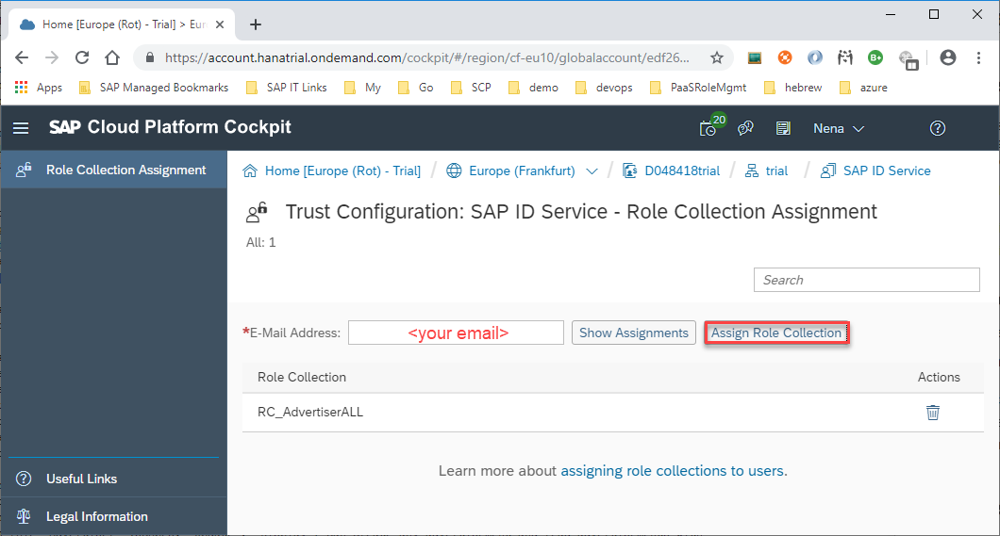

# Basic Access Limitation on Functions and Instances

The following steps will explain how to secure applications in SAP Business Technology Platform, Cloud Foundry (SAP BTP CF) which are built based on the Spring Boot.

## Goal of this sample project

This [Spring Boot 2.0](http://projects.spring.io/spring-boot/) demo application shows how to implement basic access control in Spring based SAP Business Technology Platform applications. It leverages [Spring Security 5.x](https://github.com/spring-projects/spring-security) and integrates to SAP Business Technology Platform XSUAA service (OAuth Resource Server) using the [SAP Container Security Library (Java)](https://github.com/SAP/cloud-security-xsuaa-integration), which is available on [maven central](https://search.maven.org/search?q=com.sap.cloud.security).

In order to limit access to certain instances, you can restrict the access to specific function by Roles (Scopes). Or, even more fine granular, you can restrict the access on data level so that different users can see and maintain different subsets of the data instances depending on certain user dependent attribute values.

The microservice is a Spring boot version of the code developed in the [openSAP course: Cloud-Native Development with SAP Cloud Platform](https://open.sap.com/courses/cp5) and runs in the Cloud Foundry environment within SAP Business Technology Platform.

> Note: The new `SAP Java Client Security Library` validates the access token, which is in JSON Web Token format, locally (offline). For verifying the signature of the access token it periodically retrieves and caches the JSON Web Keys (JWK) from the Authorization Server.
As consequence, in order to test our Spring Boot application locally, or as part of our JUnit tests, we have to provide a Mock Web Server that mocks the `/token_keys` endpoint that returns JWKs. Thus, this sample starts and configures a Mock Web Server for the OAuth 2.0 Authorization Server as explained [here](https://github.com/spring-projects/spring-security/tree/master/samples/boot/oauth2resourceserver). The mock server is only started in case the `uaamock` Spring profile is active.

## Table of Contents
This document is divided into the following sections
 - [Understanding OAuth 2.0 Components](#components) - introduces the SAP components that make up the OAuth setup
 - [Use Cases](#usecases) - Role-Based Access Control (RBAC) and Attribute-Based Access Control (ABAC)
 - [Download and Installation](#setupandstart) - a description of how to use this project
 - [Steps to Deploy and Test on Cloud Foundry](#deployAndTestOnCF) - explains how to deploy and test the application on Cloud Foundry
 - [Further Refererences](#furtherReading) - references and further learning material

<a id='components'></a>	
## Understanding OAuth 2.0 Components	
To better understand the content of this sample, you should have a rough understanding about the SAP BTP OAuth 2.0 components that are introduced [here](/README.md#components).

<a id='usecases'></a>
## Use Cases
In general we want to distinguish here between **Role-Based Access Control (RBAC)** and **Attribute-Based Access Control (ABAC)**.

RBAC controls access based on the roles that users have within the system whereas ABAC is more flexible as you can use attributes (user specific, resource / application specific attributes or environmental conditions) to implement instance-based access control. Any attribute can be used as "filter" to allow a more fine-grain access control to a resource.

### RBAC Use Case 1: Functional Access Restriction
Your application wants to limit the access to particular application functions, but there are no further restrictions on data level required. In this case the application developer needs to introduce a set of `Roles` as part of the security model and attach these `Role`-checks to the functions that should be secured. With that only users who have the required roles assigned are permitted to perform the restricted functions.

In our example:
- User with role "Viewer" (scope: "Display") can read all public advertisements (in his tenant).
- User with role "Advertiser" (scopes: "Update", "Display") can additionally create / update and delete public advertisements (in his tenant).

#### Recommendation
Scopes, Role-templates and Role-collections are specified by the application developer as part of the application security model ([`xs-security.json`](security/xs-security.json)).

Options to implement basic role-based authorization checks:
1. Configure Application Router to restrict access to HTTP endpoints in order to avoid unnecessary traffic ([`xs-app.json`](src/main/approuter/xs-app.json)).
1. Course-grained role checks for HTTP endpoints on application level to secure direct requests to application ([Spring Security Configuration](src/main/java/com/sap/cp/appsec/config/WebSecurityConfig.java)).
1. Fine-grained role checks on method level using method access-control expressions like `@PreAuthorize("hasAuthority('Display')")` ([Spring Web Controller](src/main/java/com/sap/cp/appsec/controllers/AdvertisementController.java)). Here you need to enable Method Security ([Method Security Configuration](src/main/java/com/sap/cp/appsec/config/MethodSecurityConfig.java)).

### ABAC Use Case 1: Access Limitation on Data Level by Resource Owner
In addition to the functional separation you want to restrict the modification and deletion of a resource to the resource owner, the one who has created the advertisement.

#### Recommendation
When Method Security is enabled ([Method Security Configuration](src/main/java/com/sap/cp/appsec/config/MethodSecurityConfig.java)) this can be easily implemented by referring to a bean as part of the Web Security Expression that implements the `isCreatedBy` check `@PreAuthorize("@webSecurity.isCreatedBy(#id)")` ([Web Security Expressions](src/main/java/com/sap/cp/appsec/security/WebSecurityExpressions.java)).

There is also the option to use `hasPermission()` expressions. Then you have to explicitly configure a PermissionEvaluator in your application context. This and much more about built-in method security expressions are documented on [Spring.io documentation](https://docs.spring.io/spring-security/site/docs/current/reference/html5/#el-access).

### ABAC Use Case 2: Access Limitation on Data Level with Filter Conditions
In addition to the functional separation you want to limit the access on data level so that different users can see and maintain different subsets of the data instances depending on certain user dependent attribute values. These attribute values can be derived from the users master data maintained in the application like cost center, organization code, department, country, location, etc. or can be set by an authorization administrator and will then be part of the user role assignment.
During data access by the user this authorization method automatically applies a filter in general by enhancing the WHERE condition of the SQL operation where the user attribute is compared to an attribute of the accessed data object.

In our example it should be possible to restrict access to instances conditional on "confidentiality_level" classification, e.g. "Public", "Internal", "Confidential" or "Strictly confidential".
- Users with role collection "RC_ViewerPUBLIC" (scope: "Display") can only read their own advertisements and advertisements with `confidentiality_level=Public`.
- Users with role collection "RC_AdvertiserPUBLIC" (scopes: "Update", "Display") can additionally create any advertisement and update all advertisements.
- Users with role collection "RC_AdvertiserALL" (scopes: "Update", "Display") and attribute `confidentiality_level=Strictly confidential` (highest classification) can furthermore read any advertisement.


#### Recommendation
Attributes and Role-templates are specified by the application developer as part of the application security model ([`xs-security.json`](security/xs-security.json)).

1. The application needs to support values-request for the application-specific attributes, e.g. `confidentiality_level` ([Example](src/main/java/com/sap/cp/appsec/controllers/AttributeFinder.java)).
1. The application needs to restrict any kind of read access (single read, read all,...) to non-public advertisements to users that are not owner and do not have access granted based on required attribute ([Example](src/main/java/com/sap/cp/appsec/controllers/AdvertisementController.java)).


## <a name="setupandstart"></a>Download and Installation
### Prerequisites
Setup your development environment according to the description [here](/prerequisites/README.md). There is no need to install **Docker**.

### Run the application in your local environment
To run the application locally, you have two options: start it directly via Maven on the command line or within your IDE (Eclipse, IntelliJ).

In both cases, your application will be deployed to an embedded Tomcat web server and will be accessible at the address `http://localhost:8080/api/v1/ads`. The endpoints of the application are secured, i.e. the endpoints will response with status code `401` (Unauthenticated) unless you provide a valid JWT token.

> **Note:** The application needs to interact with the XSUAA service to validate the JWT tokens. To avoid this interaction during test execution and as well during local testing we connect to a **local XSUAA Mock Web Server** instead. This Mock Web Server serves some XSUAA service endpoints such as `/token_keys`.  With activation of `uaamock` profile, the Mock Web Server gets started and configured according to the settings specified in the [application-uaamock.properties](src/main/resources/application-uaamock.properties) file.

> You can find [here](https://github.com/SAP/cloud-security-xsuaa-integration/tree/master/spring-xsuaa-mock#xsuaa-security-xsuaa-mock-library) a more detailed description on how to setup the XSUAA Mock Web Server in your Spring boot application.

The provided [`localEnvironmentSetup`](localEnvironmentSetup.bat) shell script can be used to set the necessary values for local execution. Within your development IDE (Eclipse, IntelliJ), you need to define the `VCAP_APPLICATION` and the `SPRING_PROFILES_ACTIVE` environment variables - as done in the script.

#### Run on the command line
Execute in terminal (within project root, which contains the `pom.xml`):
```bash
source localEnvironmentSetup.sh
mvn spring-boot:run
```

Or on Windows command line:
```bash
localEnvironmentSetup.bat
mvn spring-boot:run
```

#### Run in Eclipse (STS)
In Eclipse Spring Tool Suite (STS), you can import the project as an existing Maven project. There you can start the main method in `com.sap.cp.appsec.Application`.
You can also right-click on the class in the Package Explorer, and select `Run As` - `Spring Boot App`.  
> Make sure that you have set the same environment variables in the Run Configuration as specified in the [`localEnvironmentSetup`](localEnvironmentSetup.bat) script.

#### Excursion: JWT Token
The application endpoints are secured, that means you should get for any endpoint (except for `/actuator/health`) an 401 ("unauthorized") status code. The application expects a digitally signed JWT as part of the Authorization header to simulate that you are an authenticated user with the scopes/roles required to access the protected endpoints.

Have a look into the [`AdvertisementControllerTest`](src/test/java/com/sap/cp/appsec/controllers/AdvertisementControllerTest.java) test class. There we make use of the `JwtGenerator` from the [`spring-xsuaa-test` library](https://github.com/SAP/cloud-security-xsuaa-integration/blob/master/spring-xsuaa-test/README.md) for generating some JWT tokens with different scopes and attribute values in order to test whether the application behaves correctly and the endpoints are properly protected:

- missing JWT should result in `not authenticated (401)`
- expired or invalid signed JWT should result in `not authenticated (401)`
- JWT with missing scopes should result in `forbidden / not authorized (403)` 

> Explanation: The generated JWT Token is an "individual one" as it
>  - contains specific scope(s) e.g. `<<your appId>>.Display` (`<<your appId>>` matches the `xsuaa.xsappname` property or as part of  `VCAP_SERVICES`--`xsuaa`--`xsappname` system environment variable).
>  - it is signed with a private key that fits to the public key (JWK) of the XSUAA (or Mock Web Server).

For a better understanding you can set a breakpoint in the `setup` method of the `AdvertismentControllerTest` test, start the test in debugging mode, fetch a JWT and decode it on this web site: https://jwt.io/.


#### Test using Postman
Now you are ready to test the application manually using the [`Postman` chrome plugin](https://chrome.google.com/webstore/detail/postman/fhbjgbiflinjbdggehcddcbncdddomop).

Test the REST endpoint `http://localhost:8080/api/v1/ads` manually using the `Postman` chrome extension.

You can import the [Postman collection](documentation/testing/spring-security-local.postman_collection.json), as well as the [Postman environment](documentation/testing/spring-security-local.postman_environment.json) that provides different JWT tokens for the `Authorization` headers to do some sample requests.

**Note**: For all requests make sure, that you provide a header namely `Authorization` with a JWT token as value e.g. `Bearer eyJhbGciOiJSUzI1NiIs...`.

For reference look up [Postman documentation](https://www.getpostman.com/docs/environments).

<a id='deployAndTestOnCF'></a>
## Steps to Deploy and Test on Cloud Foundry

### Build Advertisement Service (our Java application)
Build the Advertisement Service which is a Java web application running in a Java VM. Maven build tool compiles the code and packages it in its distributable format, such as a `JAR` (Java Archive). With this the maven dependencies are downloaded from the [Maven central](https://search.maven.org/) into the `~/.m2/repository` directory. Furthermore the JUnit tests are executed and the `target/demo-application-security-basis-1.0.jar` is created.

Execute in the command line (within project directory, which contains the
`pom.xml`):
```
mvn package
```

### Login to Cloud Foundry
Make sure your are logged in to Cloud Foundry and you target your trial space.
The following commands will setup your environment to use the provided Cloud Foundry instance.

 - `cf api <<Your API endpoint>>` (API endpoints are listed [here](https://help.sap.com/viewer/65de2977205c403bbc107264b8eccf4b/Cloud/en-US/350356d1dc314d3199dca15bd2ab9b0e.html))
 - `cf login -u <<your user id>>`
 - In case you are assigned to multiple orgs, select the `trial` organisation.


### Create service
Create the (backing) service that is specified in the [`manifest.yml`](manifest.yml).

Execute in terminal (within project directory, which contains the `security` folder):
```
cf create-service xsuaa application uaa-bulletinboard -c security/xs-security.json
```
> Using the marketplace (`cf m`) you can see the backing services and its plans that are available on SAP BTP and (!) you are entitled to use.

### Configure the manifest
As a prerequisite step open the [../vars.yml](../vars.yml) file locally and replace the `ID` for example by your SAP account user name, e.g. `p0123456`, to make the routes unique. You might want to adapt the `LANDSCAPE_APPS_DOMAIN` as well.

### Deploy the approuter and the advertisement service
The application can be built and pushed using these commands (within root directory, which contains the `manifest.yml`):
```
cf push --vars-file ../vars.yml
```
> The application will be pushed using the settings provided in the `manifest.yml` and `../vars.yml`. You can get the exact urls/routes of your deployed application with `cf apps`.

<a id='approuterUri'></a>
### Create approuter route per tenant ID
We make use of the `trial` subaccount. As you can see in the SAP BTP Cockpit subaccounts have properties (see *Subaccount Details*) which of the most important one is the **Subdomain**. The Subdomain serves as the value for the technical property **Tenant ID**, e.g. `p0123456trial`.

The Tenant ID is encoded in the url, for example `https://<<your tenant ID>>-approuter-<<ID>>.<<LANDSCAPE_APPS_DOMAIN>>`.
That's why we need to specify another route for the approuter application for each Tenant ID (subdomain name). For example:
```
cf map-route approuter <<LANDSCAPE_APPS_DOMAIN e.g. cfapps.eu10.hana.ondemand.com>> -n <<your tenant ID e.g. p0123456trial>>-approuter-<<ID e.g. p0123456>>
```

After that you should see routes similar to these when calling `cf routes`:
```
space   host                                domain                           apps
dev     bulletinboard-ads-p0123456          cfapps.eu10.hana.ondemand.com    bulletinboard-ads
dev     approuter-p0123456                  cfapps.eu10.hana.ondemand.com    approuter
dev     p0123456trial-approuter-p0123456    cfapps.eu10.hana.ondemand.com    approuter
```

And `cf app approuter` shows another tenant-specific approuter route, which is hereinafter **also called "`approuterUri`"**.

<a id='testDeployedApp-1'></a>
### Test the deployed application without authorization
- Call your application endpoints e.g. `https://bulletinboard-ads-<<ID>>.cfapps.<<region>>.hana.ondemand.com`. You should get for any endpoint (except for `/actuator/health`) an `401` ("unauthorized") status code.

- On Cloud Foundry it is not possible to provide a valid JWT token, which is accepted by the XSUAA. Therefore if you like to provoke a `403` ("forbidden", "insufficient_scope") status code you need to call your application via the tenant-specific **approuter URI** in order to authenticate yourself and to create a JWT with no scopes. So, open Chrome browser and call the tenant-specific `approuterUri` URL as created [here](#approuterUri). This will bring you the **login page**. You have to enter here your SAP Cloud Identity credentials. After successful login you get redirected to the advertisement application that returns you the health status.

  > Note: This [`xs-app.json`](src/main/approuter/xs-app.json) file specifies how the approuter routes are mapped to the advertisement routes. E.g. `<<approuterUri>>/ads/actuator/health` maps to ` <<bulletinboardAdsUri>>/actuator/health`.

- Now test the deployed Web application on Cloud Foundry via the approuter url using the `Postman` chrome plugin together with the `Postman Interceptor` chrome plugin. You can import the [Postman collection](documentation/testing/spring-acl-cloudfoundry.postman_collection.json) and create within Postman an environment, which specifies the key-value pair `approuterUri`=`<<your tenant-specific approuterUri>>`.
When calling the tenant-specific approuter URI as part of `Postman` chrome plugin you probably will get as response the login screen in HTML. That's why you need to
   - enable the `Interceptor` within `Postman` **AND** within Chrome browser. You might need to install another [`Postman Interceptor` Chrome Plugin](https://chrome.google.com/webstore/detail/postman-interceptor/aicmkgpgakddgnaphhhpliifpcfhicfo), which will help you to send requests using browser cookies through the `Postman` app.
   - logon via `Chrome` Browser first and then
   - back in `Postman` resend the request e.g.
    `{{approuterUri}}/ads/api/v1/ads/` and
   - make sure that you now get a `403` status code.

### Cockpit administration tasks
Finally, as part of your Identity Provider, e.g. SAP ID Service, assign the deployed Role Collection(s) to your user as depicted in the screenshot below and as documented [here](https://help.sap.com/viewer/65de2977205c403bbc107264b8eccf4b/Cloud/en-US/9e1bf57130ef466e8017eab298b40e5e.html).



Further up-to-date information you can get on sap.help.com:
- [Maintain Role Collections](https://help.sap.com/viewer/65de2977205c403bbc107264b8eccf4b/Cloud/en-US/d5f1612d8230448bb6c02a7d9c8ac0d1.html)
- [Maintain Roles for Applications](https://help.sap.com/viewer/65de2977205c403bbc107264b8eccf4b/Cloud/en-US/7596a0bdab4649ac8a6f6721dc72db19.html).

### Test the deployed application with Authorization
According to the Role Collection(s) you've assigned to your user you should have read/write access to your application endpoints.

You need to logon again to your application so that the authorities are assigned to your user's JWT. You can provoke a logon screen when clearing your cache.

Call again your application endpoints via the approuter Uri using the `Postman` Chrome plugin as explained [here](#testDeployedApp-1). You should now be authorized to create, read and delete advertisements.

> **Troubleshoot**
> You can analyze the authorities that are assigned to the current user via `https://<<your tenant>>.authentication.<<LANDSCAPE_APPS_DOMAIN>>/config?action=who`

> **CSRF protection**
> By default the application router enables **CSRF protection** for any state-changing HTTP method. That means that you need to provide a `x-csrf-token: <token>` header for state-changing requests. You can obtain the `<token>` via a `GET` request with a `x-csrf-token: fetch` header to the application router. In this sample the csrf protection is disabled as part of the application router configuration ([`xs-app.json`](src/main/approuter/xs-app.json)).

***

# <a name="furtherReading"></a>Further References
- [openSAP course: Cloud-Native Development with SAP Cloud Platform](https://open.sap.com/courses/cp5)
- [Baeldung tutorial: A Custom Security Expression with Spring Security](https://www.baeldung.com/spring-security-create-new-custom-security-expression)
- [Spring Security Mock Authorization Server for providing token keys](https://github.com/spring-projects/spring-security/tree/master/samples/boot/oauth2resourceserver)
- [Spring Security Docs: Expression-Based Access Control](https://docs.spring.io/spring-security/site/docs/current/reference/html/el-access.html)
